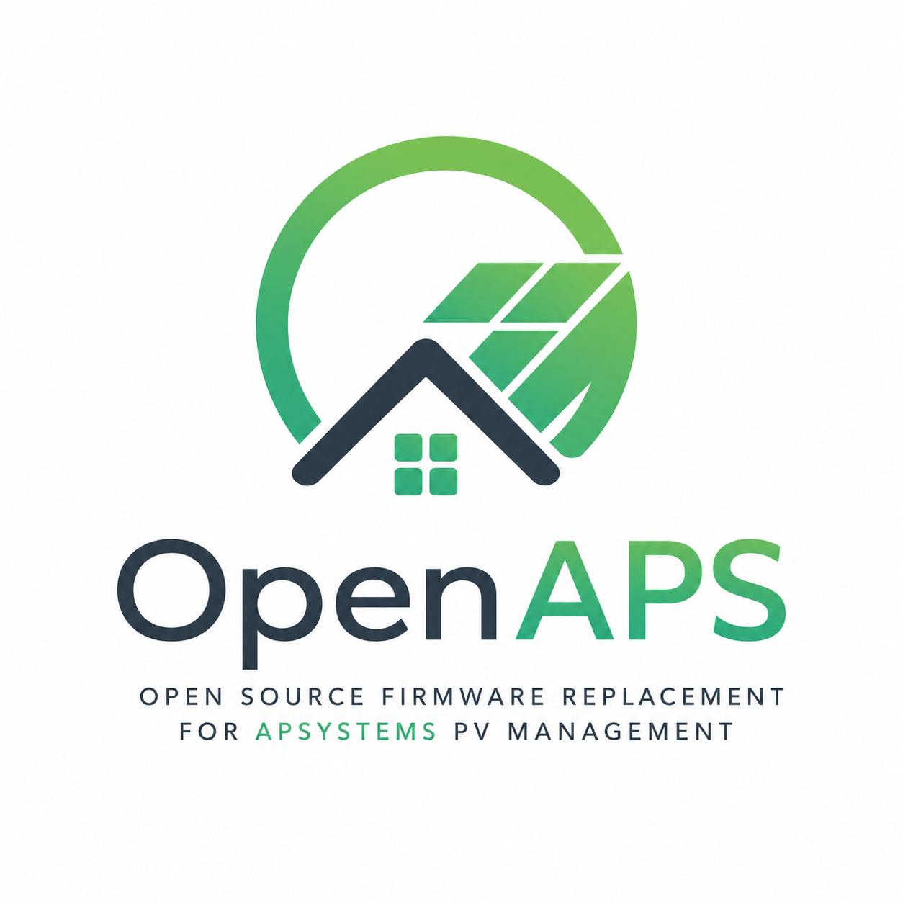
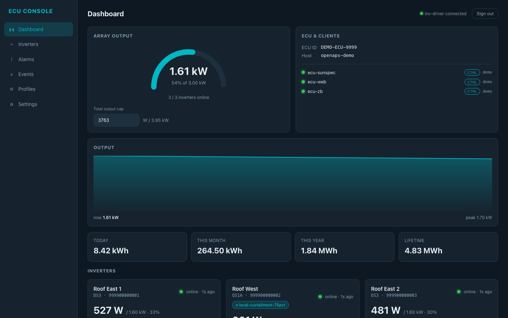
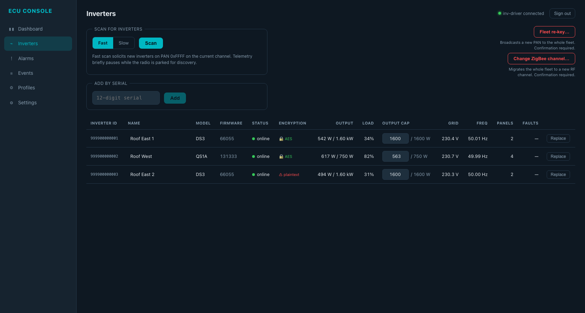
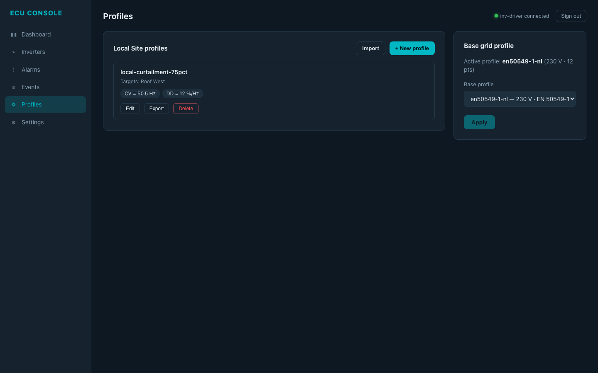

<p align="center">
  
</p>

<p align="center">
  <strong>Generic, vendor-independent firmware for APsystems microinverter fleets.</strong>
</p>

<p align="center">
  <a href="https://github.com/bolkedebruin/openaps/releases/latest"></a>
  <a href="https://github.com/bolkedebruin/openaps/actions/workflows/ci.yml"></a>
  <a href="LICENSE"></a>
</p>

---

<p align="center">
  
  
  
</p>
<p align="center">
  <em>Built-in ECU Console — dashboard (live fleet, totals, per-inverter cards), inverters (caps, encryption badges, scan/replace), profiles (base + overlays). See <a href="docs/screenshots/">docs/screenshots/</a> for events, settings and the login screen.</em>
</p>

---

OpenAPS replaces the stock firmware on APsystems ECU gateways with a clean Go stack that keeps the fleet running entirely on your LAN: no cloud uplink, no unauthenticated web admin, no firmware OTAs you don't control. You read live telemetry, push grid-protection profiles, cap output power, expose data over SunSpec/Modbus, and audit every change — locally.

**Supported hardware:** APsystems **ECU-R-Pro** (serial prefix `2162…`) and **ECU-C** (`215…`) — both run a BusyBox Linux userspace on ARMv7. **Not supported:** the original RTOS-based ECU-R (`2160…`, also sold as ECU-R-M3) and ECU-B (`2163…`) — they have no Linux userspace, so OpenAPS cannot be installed. A Raspberry Pi target is on the roadmap.

## Compatibility

| Family  | Model codes               | Telemetry | Grid profile | Set-power | Pairing | Notes                                              |
|---------|---------------------------|:--:|:--:|:--:|:--:|----------------------------------------------------|
| DS3     | `0x20 0x21 0x22 0x36`     | ✅ | ✅ | ✅ | ✅ | Live-validated                                     |
| QS1A    | `0x18`                    | ✅ | ✅ | ✅ | ✅ | Live-validated. `DC` / `CG` / `CF` rejected by inverter firmware |
| QS1     | `0x08`                    | ✅ | ✅ | ✅ | ✅ | Shares encoders with QS1A                          |
| DSP4    | `0x05 0x06`               | ✅ | ✅ | ✅ | ⚠️ | Codec implemented; pairing not exercised on hardware |
| YC600   | `0x07 0x17`               | ✅ | ✅ | ✅ | ⚠️ | Codec implemented; not exercised on hardware       |
| YC1000  | (multi-byte)              | ⚠️ | ⚠️ | ⚠️ | ⚠️ | Decoder present; needs on-hardware validation       |
| QT2     | `0x29 0x30 0x31 0x32`     | ⚠️ | ⚠️ | ⚠️ | ⚠️ | Decoder present; needs on-hardware validation       |

✅ live-validated on real hardware · ⚠️ implemented but not yet exercised on a real device

## Features

**In v1.0:**

- Live per-inverter telemetry (panels, AC/DC, RSSI, lifetime energy) — no polling delay, no cloud round-trip
- Grid-protection profile management: select base profile (e.g. `EN 50549-1`), apply per inverter, verify on read-back, audit
- Per-inverter and array-wide output-power capping; works with Victron frequency-shift curtailment
- OTA pairing: fast/slow scan, add-by-ID, replace-me (inherits the dead inverter's grid profile and operator label), full fleet PAN re-key, channel migration
- SunSpec / Modbus TCP (port `502`, the IANA-standard Modbus port) — models 101/103/111/113/123/711 etc., consumed cleanly by Home Assistant and other EMS
- HTTPS operator console on `:443` with operator-password auth + single-use recovery code + change-password
- Encryption badge per inverter (AES vs plaintext frame detection)
- Audit event log with `by` attribution for every settings/profile/power-cap change
- Rollback CLI restores the original stock firmware from a backup snapshot

**Deliberately not included (and not going to be):**

- Cloud uplink to `apsystemsema.com` / `.cn` — local-only by design
- The stock CodeIgniter web UI on `:80` (stock) — removed during install, replaced by OpenAPS on `:443`

**Open / on the roadmap:**

- Signed OTA upgrades via `POST /api/upgrade` (placeholder key ships in `v1.0.0`; production key + verify code land in `v1.0.x`)
- Raspberry Pi greenfield target — arm64 `.deb`, `systemd` units, mDNS `openaps.local`, captive-portal first-boot (v2)
- Generic CC2652P / Sonoff / ConBee USB radio support via a `ti-znp-zb` bus-manager backend (v2 — required before generic Pi is meaningfully useful)
- Per-device signing key option (v1.0 uses a single release keypair)
- WebAuthn / passkeys (deferred until a real DNS hostname exists)

## Install

> v1.0 supports brownfield migration of an existing APsystems **ECU-R-Pro** or **ECU-C**. The RTOS-based ECU-R / ECU-B are NOT compatible (no Linux userspace). Pi support is on the roadmap.

**1. Download the installer tarball** from the [latest release](https://github.com/bolkedebruin/openaps/releases/latest):

```
openaps-v1.0.0-ecu.tar.bz2
```

**2. Push it to your ECU** over the stock firmware's existing local-upgrade endpoint:

```sh
curl -F "file=@openaps-v1.0.0-ecu.tar.bz2" \
     http://<ECU-IP>/index.php/management/exec_upgrade_ecu_app
```

The orchestrator script inside the tarball:

- Takes a full backup of `/home/applications`, `/etc/rcS.d`, `/etc/init.d`, `/etc/yuneng`
- Installs SSH (`dropbear`) **first** as a recovery path and verifies it's listening
- Installs the four OpenAPS binaries + `S48..S99` init scripts
- Disables every stock APsystems supervisor (cloud uplink, unauthenticated stock endpoints, the broken `mqtt.exe` CPU-spinner, the auto-update path) by moving their binaries out of the manager's launch path
- Removes the stock `lighttpd` / CodeIgniter web UI **only after** SSH is confirmed reachable
- Starts OpenAPS in dependency order and smoke-checks the result

**3. Open `https://<ECU-IP>/`** in a browser, accept the self-signed cert, set an operator password, and start using the console.

**Roll back at any time** with:

```sh
ssh root@<ECU-IP> /usr/local/bin/openaps-rollback
```

> The bundled `dropbear` predates the algorithms modern OpenSSH ships enabled by default — drop the snippet from [`docs/SSH-CONFIG.md`](docs/SSH-CONFIG.md) into your `~/.ssh/config` on first connection.

Full install reference: [`docs/INSTALL-ECU.md`](docs/INSTALL-ECU.md). Release notes: [`docs/RELEASE.md`](docs/RELEASE.md).

## Build from source

Requires Go 1.26+ and [Bun](https://bun.sh) for the web UI bundle.

```sh
git clone https://github.com/bolkedebruin/openaps
cd openaps
make web                   # build the SPA bundle (Bun)
make build-all-arm         # cross-compile the four ARMv7 binaries
make package-openaps       # produce the brownfield ECU installer tarball
```

Output lands in `build/`. `make test` runs the full suite (`go test -race ./...` + `bun test`).

## License

[MIT](LICENSE).
